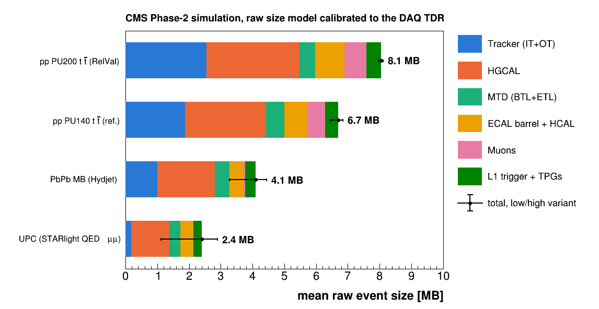
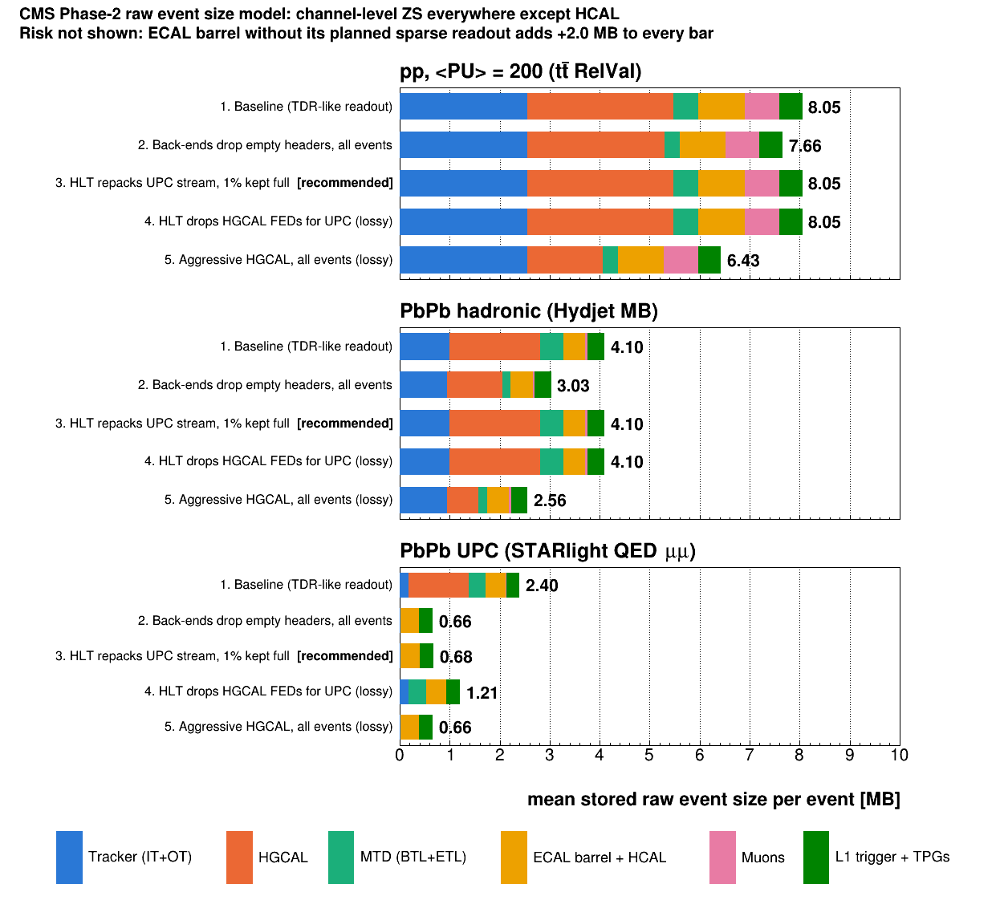

# Phase-2 raw event size: PbPb minimum bias and UPC

This estimates the Phase-2 raw (DAQ) event size, per subdetector, for Hydjet PbPb
minimum-bias events and for nearly empty UPC events (STARlight QED μμ). It uses
the step-2 GEN-SIM-DIGI-RAW samples (CMSSW_14_0_6, D110, `aging_1000`).

## Result

| MB per event | PbPb MB (Hydjet) | UPC (QED μμ) | empty event | pp PU140 | TDR PU140 | pp PU200 | TDR PU200 |
|---|---|---|---|---|---|---|---|
| Inner Tracker | 0.55 | 0.08 | 0.08 | 1.03 | 1.01 | 1.42 | 1.44 |
| Outer Tracker | 0.46 | 0.11 | 0.11 | 0.84 | 0.80 | 1.12 | 1.15 |
| MTD BTL | 0.08 | 0.01 | 0.01 | 0.17 | 0.17 | 0.06* | 0.24 |
| MTD ETL | 0.37 | 0.33 | 0.33 | 0.41 | 0.31 | 0.43 | 0.44 |
| ECAL barrel | 0.11 | 0.07 | 0.01 | 0.42 | 0.42 | 0.59 | 0.60 |
| HCAL (HB+HO+HF) | 0.33 | 0.33 | 0.33 | 0.33 | 0.33 | 0.33 | 0.33 |
| HGCAL | 1.81 | 1.19 | 1.19 | 2.55 | 2.10 | 2.93 | 3.00 |
| Muons | 0.05 | 0.01 | 0.01 | 0.54 | 0.53 | 0.70 | 0.76 |
| L1 trigger + TPGs | 0.33 | 0.27 | 0.27 | 0.41 | 0.42 | 0.46 | 0.47 |
| **Total (mean)** | **4.1** (3.3–4.4) | **2.4** (1.1–2.9) | **2.34** | 6.7 | 6.1 | **8.1** | **8.4** |

\* The CMSSW_16 PU200 RelVal has 3× fewer BTL digis than the 14_x samples
(changed BTL simulation/geometry), so BTL is not comparable there.

- **PbPb MB:** the median is 3.1 MB and the most central events reach about
  10 MB, more than a pp PU200 event. The size is linear in event activity
  ([`plots/raw_size_vs_activity.png`](plots/raw_size_vs_activity.png)).
- **UPC ≈ empty event.** The "empty event" column is the model with zero hits:
  2.34 MB is sent for every L1 accept, whatever the occupancy. The UPC events
  add only about 60 kB of real hits on top. The biggest fixed pieces are:
  - HGCAL, 1.19 MB: one ECON-D header + CRC (12 B) for each of the 29.8k
    modules, plus a 32-bit sub-packet header for each of the 209k eRx
    (half-HGCROCs), sent even when empty. Both counts come from the CMSSW
    HGCAL electronics map.
  - HCAL, 0.33 MB: no zero suppression in the Phase-2 baseline.
  - ETL, 0.33 MB: ETROC header + trailer per chip.
  - L1 trigger readout, 0.27 MB.

  The low end of the range (1.1 MB) assumes the back-ends drop empty
  sub-packets (HGCAL eRx, ETROC frames). HCAL plus L1 are a hard floor of
  about 0.6 MB.
- **pp PU200 is an independent test.** The model is calibrated only on the
  PU140 RelVal. Applied to a real PU200 RelVal (CMSSW_16_1_0_pre4, D121,
  `averageNumber = 200`, 60 ttbar events), it reproduces DAQ TDR Table 3.2
  within 1–3% for IT, OT, ETL, ECAL, HGCAL and L1, and within 8% for the
  muons. Occupancy grows almost linearly with pileup: the PU200/PU140 ratio is
  1.41 for IT digis, 1.39 for OT digis and 1.31–1.44 for HGCAL depending on
  threshold, against 1.43 expected.
- **PU140 column:** the TDR's PU140 sizes are its PU200 simulation scaled
  linearly with pileup, which implicitly assumes no fixed part. With the fixed
  overheads, the model is somewhat above the TDR at PU140 (6.7 vs 6.1 MB) by
  construction.

### Published pp estimates

- **Phase-2 DAQ & HLT TDR**, CMS-TDR-022 (CERN-LHCC-2021-007), Table 3.2: per
  subdetector sizes and back-end counts. The total is 6.1 MB at PU140 and
  8.4 MB at PU200 (§3.2). Each subdetector group made its own estimate, based
  on PU200 ttbar + MB simulation including noise for IT, OT and HGCAL. The
  PU140 numbers were scaled linearly. Some systems (HCAL, L1) are fixed size
  with no zero suppression. §1.2.3 also has the only heavy-ion statement:
  average PbPb ≈ pp PU100, with an assumed average PbPb event of 5 MB.
- **Interim DAQ TDR**, CMS-TDR-018 (2017): 7.4 MB at PU200, summarised in
  [arXiv:1806.08975](https://arxiv.org/abs/1806.08975).
- The per-subdetector inputs trace back to the subdetector TDRs: Tracker
  (CMS-TDR-014), barrel calorimeters (CMS-TDR-015), muons (CMS-TDR-016),
  HGCAL (CMS-TDR-019), MTD (CMS-TDR-020) and L1 (CMS-TDR-021).



## Readout options and recommendation

Stored raw event size, i.e. what the HLT writes, per event class
(`scripts/size_model.py`, `OPTIONS`):

| Option | Where it acts | Lossless? | pp PU200 | PbPb hadronic | PbPb UPC |
|---|---|---|---|---|---|
| 1. Baseline (TDR-like readout: channel ZS, all headers kept) | – | – | 8.05 | 4.10 | 2.40 |
| 2. Back-ends drop empty headers, all events | back-end firmware, all subsystems | yes (hits); loses per-unit status/CM words | 7.66 | 3.03 | 0.66 |
| 2b. As 2, only for UPC-flagged L1As (TCDS trigger type) | back-end firmware + TCDS | as 2 | 8.05 | 4.10 | 0.66 |
| **3. HLT repacks the UPC stream (drop empty sub-packets), 1% prescaled kept in full format** | **HLT, software only** | **yes (hits); status/CM kept for 1%** | **8.05** | **4.10** | **0.68** |
| 4. HLT drops HGCAL FEDs for UPC | HLT (`EvFFEDSelector`) | no: no HGCAL (rapidity gaps!) | 8.05 | 4.10 | 1.21 |
| 5. Aggressive HGCAL, all events (as 2 + ZS at ~1 MIP + 16-bit words) | front-end config + back-end | no: MIP/timing info lost | 6.43 | 2.56 | 0.66 |



**Recommendation: option 3.** For heavy ions the constraint is storage, not
the DAQ. Reading out all ~50 kHz of PbPb interactions at ~4 MB is about 1.6
Tb/s, about 3% of the 50 Tb/s pp design. So the empty headers can travel
through event building at no real cost, and be removed where the event class
is known: at the HLT, per stream. It:

- needs no front-end or back-end firmware changes. The front-end chips cannot
  do it anyway, because they do not know the trigger type.
- is lossless for hits.
- leaves the hadronic and pp formats untouched.
- follows Run-3 PbPb practice, where HLT-level repacking of raw data
  ("raw′", approximated strip clusters) was already used for HI streams.

What it needs:
- an HLT repacker for the HGCAL, ETL and tracker FED payloads;
- unpackers that accept missing sub-packets;
- a prescaled full-format sample for monitoring the dropped status and
  common-mode words.

Option 2 gives the same UPC saving plus about 1 MB on hadronic PbPb, but needs
firmware in every subsystem and changes the format for all events. It is
worth raising with the DAQ/HGCAL groups as a longer-term improvement. Options
4 and 5 are lossy and not recommended for physics streams.

Independent of the option: if the ECAL barrel ships without its planned
sparse readout, add +2.0 MB to every number above.

## pPb at 750 kHz

EPOS pPb MB (`/eos/cms/store/group/phys_heavyions/davidlw/EPOSpPbPhase2_PrivateMC/Step2_DIGI_RAW_CMSSW_14_0_6_tpminpt0p3`,
1000 events; `data/ppb.jsonl`, `data/eb_ppb.jsonl`). An average pPb event has
7.4k pixel digis, against 191k for PbPb MB and 547k for pp PU200, i.e. about
pp at PU≈3. So, as for UPC, the size is almost all fixed overhead.

| MB per event | Baseline (all headers) | Empty headers dropped |
|---|---|---|
| Inner Tracker | 0.10 | 0.05 |
| Outer Tracker | 0.12 | 0.03 |
| MTD (BTL+ETL) | 0.34 | 0.01 |
| ECAL barrel | 0.07 | 0.06 |
| HCAL | 0.33 | 0.33 |
| HGCAL | 1.22 | 0.09 |
| Muons | 0.01 | 0.00 |
| L1 trigger + TPGs | 0.27 | 0.27 |
| **Total** | **2.47** | **0.84** |

Stored size and throughput at **750 kHz**, against the TDR heavy-ion storage
budget of 51 GB/s (`scripts/ppb_budget.py`, cumulative):

| Step | kB/event | GB/s | × budget |
|---|---|---|---|
| 0. Baseline raw | 2471 | 1853 | 36 |
| 1. Empty headers dropped (lossless) | 842 | 631 | 12 |
| 2. + HCAL ZS (assumed 0.05 MB), L1 final objects only (assumed 0.02 MB) | 309 | 232 | 4.5 |
| 3. + local reco IT/OT/HGCAL (6/3/5 B per cluster/cluster/cell) | 186 | 139 | 2.7 |
| 4. + ECAL barrel ZS at 5σ instead of 3σ (noise crystals 628 → 2) | 124 | 93 | 1.8 |
| 5. + lossless compression ×1.5 (assumed) | 82 | 62 | 1.2 |
| **T1. Tracker(+MTD) stream: IT+OT compact raw, MTD, L1 final** | **108** | **81** | **1.6** |
| **T2. Tracker(+MTD) stream: IT+OT clusters, MTD, L1 final** | **52** | **39** | **0.8** |

- **The DAQ is fine:** 750 kHz × 2.5 MB ≈ 15 Tb/s, against the 50 Tb/s pp
  design. Storage is the problem. At 750 kHz, 51 GB/s allows 68 kB per event.
- **No full-detector format gets there without lossy steps.** After every
  lossless step, the fixed floor of HCAL + L1 (0.6 MB) alone would be
  450 GB/s.
- **ECAL barrel noise matters here.** With `aging_1000` noise, about 600
  noise crystals pass 3σ in every event, and at about 100 B each they are the
  largest single item after steps 1–3. A 5σ threshold removes them.
- **A reduced stream for the 750 kHz MB sample is the realistic option.** Keep
  the tracker (clusters) and MTD (for PID) and the L1 objects, i.e. what
  high-multiplicity / flow / correlation analyses use. Record full raw for a
  lower-rate subset. T2 fits the budget at about 40 GB/s. It is lossy (no
  pixel charge, no re-clustering), so keep a prescaled full-raw sample.
- **Pileup is a small effect.** The expected p–Pb peak luminosity is about
  1.7 × 10³⁰ (HL-LHC Yellow Report), and σ_inel ≈ 2.1 b gives μ ≈ 0.28 per
  crossing. Triggered crossings then carry 1.15 collisions on average, adding
  about 26 kB of hits. At the μ ≈ 0.06 that is enough for 750 kHz, it adds
  about 5 kB.

## Expected collision rates in Run 4 and Run 5

The source is R. Bruce, *Projected heavy-ion performance in Run 4 and Run 5*
(LPC, 2026). `scripts/lumi_scenarios.py` reproduces all numbers below.

### Pb–Pb at CMS (σ_had = 7.8 b, 1032 colliding bunch pairs)

| Scenario | Peak L (10²⁷ cm⁻²s⁻¹) | Hadronic rate | μ | Source |
|---|---|---|---|---|
| Run 4, levelled (2026-like, β* = 0.5 m) | 6.4 | **50 kHz** | 0.004 | measured 2024–26 plateaus (p. 20) |
| Run 4, no levelling (β* = 0.5 m) | ~13 | ~100 kHz | 0.009 | CTE simulation (p. 27) |
| Run 5, no levelling, β* = 0.4 m | ~16 | ~125 kHz | 0.011 | p. 27 |
| Run 5, no levelling, β* = 0.3 m | ~20 | ~155 kHz | 0.013 | p. 27 |
| Run 5, no levelling, β* = 0.25 m ("less likely") | ~24 | ~185 kHz | 0.016 | p. 27 |

- **Unlevelled** values are start-of-fill peaks, read from the IP2 curves on
  p. 27. IP1/5 have the same β* and bunch count; the crossing angles differ,
  so allow about ±10%. These peaks halve within about 1.5–2 h.
- **Run 4 will most likely be 2026-like:** the talk says it is "not likely we
  can directly go to pushed configuration directly in Run 4".

### p–Pb at CMS (Run 4; the Run 5 programme is not decided)

| Scenario | L (10³⁰) | Rate | μ | Collisions per triggered crossing |
|---|---|---|---|---|
| 5.36 TeV, levelled 1 × 10³⁰ | 1.0 | 2.1 MHz | 0.18 | 1.09 |
| 5.36 TeV, levelled 2 × 10³⁰ = no levelling (potential below target) | 1.48 | 3.1 MHz | 0.26 | 1.14 |
| 8.54 TeV, levelled 1 × 10³⁰ | 1.0 | 2.1 MHz | 0.18 | 1.09 |
| 8.54 TeV, levelled 2 × 10³⁰ | 2.0 | 4.3 MHz | 0.36 | 1.19 |
| 8.54 TeV, no levelling | 2.28 | 4.9 MHz | 0.41 | 1.22 |

(25 ns p beam, 1056 colliding pairs. The 50 ns scheme, with 955 pairs, is
about 10% lower in potential and has similar μ.)

- **Inputs:** levelling targets, beam intensities (3 × 10¹⁰ p, 2.31 × 10⁸ Pb
  per bunch), emittances, β* = 0.5 m and cross sections are from the CTE
  initial conditions (p. 28).
- **The unlevelled potential is computed here**, including a crossing-angle
  factor of 0.91–0.94.
- **All p–Pb scenarios exceed the 750 kHz L1 limit by 3–6×.** Recording
  750 kHz means prescaling MB or levelling at about 0.36 × 10³⁰ (μ ≈ 0.06).
  At the planned 1–2 × 10³⁰, a triggered crossing carries 1.1–1.2 collisions.
  That adds roughly 15–45 kB of hits per event (scaling the EPOS pPb hit
  content), small compared with the fixed overhead.

### p–Pb luminosity: 8.54 vs 5.36 TeV

At the same normalised emittance and β*, the geometric emittance scales as
1/γ and the peak luminosity as γ, i.e. 6.8/4.27 = 1.59. The crossing angle
reduces this slightly. A simple fill model (Pb burn-off at all four IPs,
3 h turnaround, optimal fill length) gives:

| IP1/5 levelling | Peak L gain | Fill-averaged L gain | nb⁻¹/day at 100% efficiency (5.36 → 8.54 TeV) |
|---|---|---|---|
| 1 × 10³⁰ | – (both levelled) | ×1.10 | 56 → 62 |
| 2 × 10³⁰ | ×1.35 | ×1.35 | 62 → 84 |
| none | ×1.54 | ×1.36 | 62 → 84 |

- **With levelling at 1 × 10³⁰ the gain is only about 10%:** both energies
  sit on the same plateau, and 8.54 TeV just levels longer.
- **With 2 × 10³⁰ or no levelling, 8.54 TeV gives about 35% more integrated
  luminosity.**
- **The model ignores intrabeam scattering and radiation damping.** Both
  favour the higher energy, so these gains are probably slight
  underestimates. The ~60 nb⁻¹/day scale is consistent with the talk's
  430–720 nb⁻¹ per 29-day run.
- **σ_had changes little** (2.08 → 2.13 b). Hard-process cross sections grow
  much more with √s, so the physics yield gain for hard probes is larger than
  the luminosity gain alone.

## Method

### Is `rawDataCollector` complete? No.

Checked three ways:

1. **FED numbering.** `DataFormats/FEDRawData/interface/FEDNumbering.h` (the
   same in 14_0_6 and `master`) has no FED ID range for the Phase-2
   IT/OT, HGCAL, MTD or Phase-2 ECAL barrel. Only Run-2/3 detectors are
   listed.
2. **Packers.** In the full CMSSW_16_1_1 source, the only modules that
   produce a `FEDRawDataCollection` are the Run-2/3 packers: ECAL, ES, HCAL,
   CSC, DT, RPC, GEM, CTPPS, Stage-2 L1, and Phase-1 `SiPixelDigiToRaw`.
   `DigiToRaw_cff.py` removes the pixel and strip packers for `phase2_tracker`
   ("`# FIXME`") and the RPC packer for `phase2_muon`. HGCAL
   (`HGCalRawToDigi`) and the OT (`Phase2TrackerRawToDigi`) have unpackers
   only.
3. **The files themselves.** In all four samples, every filled FED lies in a
   legacy range and none is unassigned:

   | FEDs filled (mean kB/event) | UPC | PbPb MB | pp PU140 | pp PU200 |
   |---|---|---|---|---|
   | HCAL uTCA 1120–1137 + VME 700–731 | 289 | 289 | 290 | 290 |
   | ECAL legacy 601–654 (Run-2 selective readout) | 58 | 106 | 204 | 265 |
   | GEM / ME0 1467–1474 (legacy format) | 0.2 | 59 | 673 | 775 |
   | CSC 831–869 | 2 | 24 | 197 | 299 |
   | DT uROS 1369–1371 | 0.1 | 0.1 | 0.8 | 0.8 |
   | Stage-2 (Run-3) L1 1354–1404 | 27 | 29 | 60 | 58 |
   | **Total `rawDataCollector`** | **377** | **508** | **1424** | **1688** |
   | Tracker, HGCAL, MTD, RPC, Phase-2 L1 | – | – | – | – |

   At PU200, `rawDataCollector` holds 1.7 MB against the TDR's 8.4 MB. Even
   the FEDs that are present are Run-2/3 formats. For example, the legacy
   GEM packer gives 0.77 MB at PU200 against the TDR's 0.125 MB for
   GEM+ME0, so they are not used directly. The exception is HCAL, whose
   0.29 MB agrees with the TDR's fixed 0.33 MB.

### Per-subdetector estimate

Each subdetector is modelled as `size = fixed + per_hit × N_hits`.

| Subdetector | Phase-2 packer? | N_hits counted from (step-2) | Fixed part (per L1A) | Per-hit cost | How per-hit is set |
|---|---|---|---|---|---|
| Inner Tracker | no | `simSiPixelDigis:Pixel` digis | 10k CROC chips × 8 B = 0.08 MB | 2.45 B / digi | fit to TDR |
| Outer Tracker | no | `siPhase2Clusters` clusters (or digis × 0.38) | 13.2k modules × 8 B (CIC headers) = 0.11 MB | 4.1 B / cluster | fit to TDR |
| MTD BTL | no | `mix:FTLBarrel` frames | 0.01 MB | 3.8 B / hit | fit to TDR |
| MTD ETL | no | `mix:FTLEndcap` frames | 33k ETROC × 10 B (header+trailer) = 0.33 MB | 4.8 B / hit | fit to TDR |
| ECAL barrel | legacy only | crystals > 3σ (12 ADC) in `simEcalUnsuppressedDigis` | 0.01 MB | 100 B / crystal | fit to TDR |
| HCAL (HB, HO, HF) | yes (legacy format) | – | 0.33 MB (no zero suppression; TDR) | – | fixed; FEDs give 0.29 MB |
| HGCAL | no | cells above in-time ADC threshold in `simHGCalUnsuppressedDigis` EE/HEF/HEB | 29.8k ECON-D × 12 B + 209k eRx × 4 B = 1.19 MB | 3.5 B / cell + 4 B / non-empty eRx | ZS threshold fit to TDR (1.4 fC) |
| Muons: DT, CSC, GEM+ME0, RPC | legacy (no RPC) | `simMuon*Digis` | 0.01 MB | TDR size per system × digi ratio | scaled, not fitted |
| L1 trigger + TPGs | Run-3 only | HGCAL cells (for the HGCAL TPG part) | 0.26 MB L1 + 0.01 MB track finder (TDR) | HGCAL TPG 0.20 MB × HGCAL occupancy | TDR |

- **"Fit to TDR"** means the per-hit cost is chosen so that the PU140 RelVal,
  with counts × 200/140, reproduces DAQ TDR Table 3.2 at PU200.
- **Fixed parts** come bottom-up from the front-end formats. The HGCAL format
  is from `EventFilter/HGCalRawToDigi/src/HGCalUnpacker.cc`. The HGCAL counts
  come from `data-Geometry-HGCalMapping` V00-07-00
  (`modulelocator_CEminus_V15p5.txt` × 2 endcaps, with half-ROCs per module
  type from the cell maps).
- **HCAL and L1** are fixed by the TDR design, independent of occupancy.
- **ECAL barrel** noise σ = 4.0 ADC is measured in the noise-only UPC sample.

### Systematic variants (low / high)

| parameter | nominal | low | high |
|---|---|---|---|
| IT bytes per chip | 8 | 4 | 16 |
| OT bytes per module | 8 | 4 | 33 (i.e. 2 B per cluster, the rest in headers) |
| HGCAL empty eRx header | 4 B | 0 (dropped by back-end) | 4 B |
| HGCAL bytes per hit | 3.5 | 3.0 | 4.0 |
| ETL per-ETROC header | 10 B | 0 (compressed in back-end) | 10 B |
| BTL, EB, muon fixed parts | small | 0 | ×3 |

The per-hit terms are re-calibrated in every variant, so all three variants
agree with the TDR at PU200 and differ only in how much of the size is fixed. That fixed
fraction is exactly what drives the UPC number.

## Readout scenarios

### What is assumed about zero suppression

Every number in this README assumes **channel-level zero suppression (ZS)**.
Only channels above threshold contribute hit data. The one exception is HCAL,
whose Phase-2 baseline has no ZS. Per subdetector:

| Subdetector | Channel-level ZS in the model | Basis | Safe to assume? |
|---|---|---|---|
| Inner Tracker | only digitized pixels above threshold (`simSiPixelDigis`) | CROC sends hit pixels only | yes, intrinsic to the chip |
| Outer Tracker | only clusters | CIC sends sparsified clusters | yes, intrinsic |
| MTD BTL / ETL | only hits above threshold (`mix:FTLBarrel/Endcap`) | TDR: BTL at 0.25 MIP | yes, intrinsic |
| HGCAL | only cells above a 1.4 fC in-time threshold (fit to TDR) | TDR: ZS in the ECON-D | yes (threshold value is a fit) |
| ECAL barrel | only crystals > 3σ | TDR: sparse readout "planned" in the BCP | **not guaranteed**: see below |
| HCAL | **none**: fixed 0.33 MB | TDR: "zero suppression is not being considered" | yes: no ZS is the baseline |
| Muons | TDR sizes, which assume ZS (GEM, ME0) or intrinsic sparsity (CSC, DT) | TDR | yes |
| L1 trigger | fixed | TDR | yes |

ZS removes empty *channels*, not empty *packets*. The two open choices are:

- **Headers:** does every readout unit send a header on every L1A, even when
  it has no hits? The baseline model says yes, following the CMSSW HGCAL
  unpacker's format. No published design says the back-ends drop them.
- **ECAL barrel:** is its sparse readout actually implemented? The TDR
  assumes 0.6 MB at PU200 with it, and 2.1 MB fixed without it.

### Totals (MB per event)

| Scenario | UPC | PbPb MB | pp PU140 | pp PU200 |
|---|---|---|---|---|
| **Baseline:** channel ZS, all headers kept, EB sparse readout | **2.40** | **4.10** | 6.70 | 8.05 |
| Headers only for readout units with hits | 0.66 | 3.03 | 6.19 | 7.66 |
| EB full readout, all headers kept | 4.43 | 6.08 | 8.38 | 9.56 |
| EB full readout, headers only for units with hits | 2.70 | 5.03 | 7.87 | 9.18 |

In "headers only for units with hits", header counts come from the number of
units with hits:

| Detector | Headers kept for |
|---|---|
| IT | chips on modules with digis |
| OT | modules with clusters |
| ETL | ETROCs with hits (Poisson) |
| HGCAL | ECON-D and eRx with cells above threshold (Poisson) |

The small fixed parts of BTL, EB and muons are removed too. Per-hit costs keep
the nominal calibration, so this scenario undershoots the TDR at PU200 by the
header size.

### Breakdown, baseline vs. headers only for units with hits (MB per event)

| Subdetector | UPC | UPC, no empty headers | PbPb MB | PbPb MB, no empty headers | pp PU200 | pp PU200, no empty headers |
|---|---|---|---|---|---|---|
| Inner Tracker | 0.08 | 0.00 | 0.55 | 0.53 | 1.42 | 1.42 |
| Outer Tracker | 0.11 | 0.00 | 0.46 | 0.42 | 1.12 | 1.12 |
| MTD BTL | 0.01 | 0.00 | 0.08 | 0.07 | 0.06 | 0.05 |
| MTD ETL | 0.33 | 0.00 | 0.37 | 0.10 | 0.43 | 0.26 |
| ECAL barrel | 0.07 | 0.06 | 0.11 | 0.10 | 0.59 | 0.58 |
| HCAL | 0.33 | 0.33 | 0.33 | 0.33 | 0.33 | 0.33 |
| HGCAL | 1.19 | 0.00 | 1.81 | 1.09 | 2.93 | 2.74 |
| Muons | 0.01 | 0.00 | 0.05 | 0.04 | 0.70 | 0.69 |
| L1 trigger + TPGs | 0.27 | 0.27 | 0.33 | 0.33 | 0.46 | 0.46 |
| **Total** | **2.40** | **0.66** | **4.10** | **3.03** | **8.05** | **7.66** |

- **UPC:** the event size is set almost entirely by the header policy. It is
  0.66 MB without empty headers (HCAL + L1 + ~60 kB of hits) and 2.4 MB with
  them.
- **ECAL barrel:** without sparse readout it adds a flat +2.0 MB to every
  event, the largest single risk.
- **At PU200**, the header policy matters little (5%), which is presumably why
  the TDR does not discuss it.

## Options to reduce HGCAL

Each option below is evaluated with the same model (HGCAL sub-event only, MB
per event):

| Option | UPC | PbPb MB | pp PU200 |
|---|---|---|---|
| Baseline: all headers, ZS at 1.4 fC, 3.5 B/cell | 1.19 | 1.81 | 2.93 |
| A. Back-end drops empty eRx sub-packets | 0.36 | 1.23 | 2.74 |
| B. A + drop ECON-D packets of modules with no hits | ~0 | 1.09 | 2.74 |
| C. Higher ZS threshold, ~0.5 MIP (27 ADC) | 1.19 | 1.75 | 2.73 |
| D. Higher ZS threshold, ~1 MIP (54 ADC) | 1.19 | 1.55 | 2.15 |
| E. Minimal channel word, ADC only (16 bit) | 1.19 | 1.66 | 2.47 |
| F. B + D + E | ~0 | 0.62 | 1.51 |
| G. Drop HGCAL from the stored event (HLT FED selection) | 0 | 0 | 0 |

- **For UPC and empty events, only the header options matter** (A, B, or G);
  thresholds and word size do nothing. A and B would be back-end firmware
  choices. In the format the CMSSW unpacker expects, the ECON-D sends its
  header and one sub-packet per enabled eRx on every L1A, so the saving would
  have to come from the back-end reformatting before the DTH.
- **For PbPb MB**, removing empty headers (A/B) buys 0.6–0.7 MB. The
  threshold and word size (D, E) buy another 0.4 MB, at a physics cost:
  MIP-level energy and timing.
- **G can be applied at the HLT** today with existing CMSSW tools
  (`EvFFEDSelector` / `RawDataSelector`, which already write FED subsets for
  calibration streams). It only makes sense if the analysis does not need
  HGCAL, e.g. forward rapidity-gap vetoes do need it. A lighter version is to
  replace HGCAL raw with HLT-level clusters/rechits. The TDR notes this is
  under study (§3.2.8).

## Caveats

- **The UPC result depends mostly on readout choices, not on the simulation.**
  The dominant question is whether HGCAL's ECON-D really sends an empty eRx
  header for every eRx on every L1A (the unpacker expects this). A second
  question is whether the ETL back-end strips empty ETROC frames. If the
  back-ends suppress empty sub-packets, UPC drops to about 1.1 MB (the "low"
  variant, which drops only the HGCAL eRx and ETL frames). If every empty
  header is dropped, it falls to 0.66 MB (see "Readout scenarios"). HCAL and
  L1 alone are a hard floor of about 0.6 MB.
- **ECAL barrel** noise with `aging_1000` is about 4 ADC (≈160 MeV) per sample
  in the legacy digis, so a 3σ zero suppression is noise-dominated in both
  samples. The Phase-2 barrel will run colder with new electronics, so the EB
  number is uncertain by about 2×, but it is small either way.
- **HGCAL noise:** at the calibrated threshold (1.4 fC), UPC events have only
  about 20 noise cells. At the digitizer's 0.5 fC threshold they would have
  about 19k, which is still only about 0.07 MB. So HGCAL in UPC is headers,
  not noise.
- The PU140 calibration sample uses geometry D112 in 14_1_0_pre3, against D110
  for the HI samples. The geometry differences have not been checked in
  detail. The calibration only uses per-hit costs, which should be insensitive
  to them.
- Not included:
  - ZDC and forward detectors (a few kB)
  - DTH/S-Link fragment framing (about 32 B × roughly 1000 streams)
  - extended-readout (diagnostic) events
- Hydjet here is minimum bias with 200 events. Its mean IT occupancy is 0.49×
  that of pp PU140, i.e. about "PU70-equivalent" on average.

## Reproducing

On lxplus (`cmssw-el8`, inside a CMSSW_14_0_6 `cmsenv`, or 14_1_X for the RelVal):

```bash
python3 scripts/dump_counts.py data/hydjet.jsonl <step2 files...>
python3 scripts/dump_eb.py     data/eb_hydjet.jsonl <step2 files...>
# MAXEV=15 limits events per file (used for the 8 GB PU140 RelVal files)
```

`data/pu200.jsonl` / `data/eb_pu200.jsonl` hold the real PU200 RelVal
(`/RelValTTbar_14TeV/CMSSW_16_1_0_pre4-PU_150X_mcRun4_realistic_v1_STD_D121_RegeneratedGS_PU_20260420_140840-v3`,
dumped in CMSSW_16_1_1_patch1). If they are missing, `size_model.py` falls
back to PU140 × 200/140. That RelVal does not keep `siPhase2Clusters`, so OT
clusters are derived from OT digis with the PU140 cluster/digi ratio.

Then, anywhere with plain Python 3 (the model has no dependencies):

```bash
python3 scripts/size_model.py data            # prints tables, writes data/size_model_results.json
python3 scripts/plot_sizes.py data/size_model_results.json plots   # needs PyROOT
```

All model parameters are in the `P` dictionary at the top of `size_model.py`.
